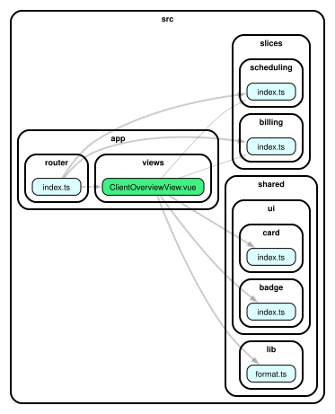
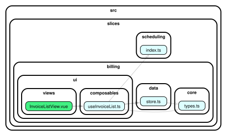

<p align="center">
  
</p>

<h1 align="center">Vise</h1>

<p align="center">
  <b>A machine-enforced frontend architecture starter.</b><br>
  Every file has one derivable home — and CI fails the build if it drifts.
</p>

---

Vise is a small Vue 3 + [Vite+](https://viteplus.dev) monorepo (`apps/web`) that
demonstrates one opinionated frontend architecture and **enforces it by machine**.
The bet: if the structure is _derivable_, two developers implementing the same
request independently produce the same layout — so _"where does this go?"_ has an
answer, not an argument. Boundaries are checked in CI, not in code review.

> [!IMPORTANT]
> **Research / reference starter — not production-ready.** The billing +
> scheduling features are a mock (MSW) app that exists only to demonstrate the
> architecture and its guardrails. Use Vise to study the pattern or bootstrap an
> experiment — not as a batteries-included product template.

## What it demonstrates

- **Two axes → one home.** Every file has a coordinate: a _domain slice_
  (`billing`, `scheduling`) × a _stability layer_ (`core` → `data` → `ui`, plus
  the global `shared` and `app` bands). The coordinate is the folder.
- **A framework-free domain core.** Delete Vue and every `core/` folder still
  compiles and its tests still pass. Core is _pure_: no clock, no randomness, no IO.
- **Slice isolation.** Slices are silos that reach each other only through a tiny
  public `index.ts`; deep imports don't even resolve.
- **Derivable, not disciplined.** The rules are encoded once in
  `architecture.config.ts` and generate every linter config.

## See the boundaries

Two focused dependency graphs, each rendered by the `graph` task
(`node scripts/depcruise-focus.mjs <file>`). Every arrow points toward stability,
and cross-slice traffic is pinched through each silo's public `index.ts`.

<p align="center">
  
  <br>
  <sub><b>The composition root.</b> <code>app/views/ClientOverviewView.vue</code> — the one cross-slice screen — reaches both silos only through their public <code>index.ts</code>, and pulls primitives from <code>shared/</code>.</sub>
</p>

<p align="center">
  
  <br>
  <sub><b>The blessed cross-slice read.</b> <code>billing/ui/composables/useInvoiceList.ts</code> uses its own <code>core</code> + <code>data</code>, and reaches <code>scheduling</code> only through its door.</sub>
</p>

New to these? [Reading the graph](docs/reading-the-graph.md) explains how to generate one and what to look for.

## Guardrails

All machine-enforced, at `severity: error` — there is no `warn` tier.

- **25+ boundary rules** across [dependency-cruiser](https://github.com/sverweij/dependency-cruiser),
  [Oxlint](https://oxc.rs), and Vitest structure tests — every one **self-verified
  to actually bite** (`verify:enforcement`).
- **Allow-list** dependency rules (no holes by construction) plus a **baseline
  ratchet** that can only shrink, for migrating legacy code.
- No sideways slice imports · no framework in `core/` · DTOs never leave `data/` ·
  no domain nouns in `shared/` · no silent disable comments.
- One **source of truth** — a test fails if the generated configs ever drift from it.

## Stack

Vue 3 `<script setup>` · TypeScript strict · [Vite+](https://viteplus.dev) (`vp` —
Vite, Vitest, Oxlint, Oxfmt, Rolldown, tsdown) · Vue Router · Pinia (one store, on
purpose) · [shadcn-vue](https://www.shadcn-vue.com) on Reka UI · Tailwind v4 · MSW.

## Quickstart

```bash
vp install            # install deps (via pnpm)
vp dev apps/web       # dev server (MSW-mocked API)
vp check              # lint + typecheck + tests
```

## Documentation

| Doc                                            | What's inside                                                                    |
| ---------------------------------------------- | -------------------------------------------------------------------------------- |
| [Architecture](docs/architecture.md)           | The two axes, the layers, the folder layout, the dependency graph                |
| [The constitution](docs/constitution.md)       | The 8 non-negotiable rules, their corollaries, and the helper questions          |
| [Adding a feature](docs/adding-a-feature.md)   | Junior field guide: where things go, the workflow, and decoding a red CI         |
| [Worked examples](docs/worked-examples.md)     | Six real requests resolved by precedent                                          |
| [Enforcement](docs/enforcement.md)             | Every rule, the tool that checks it, the baseline ratchet, anti-loosening        |
| [Reading the graph](docs/reading-the-graph.md) | How to generate a focused dependency graph and what to look for when reading one |
