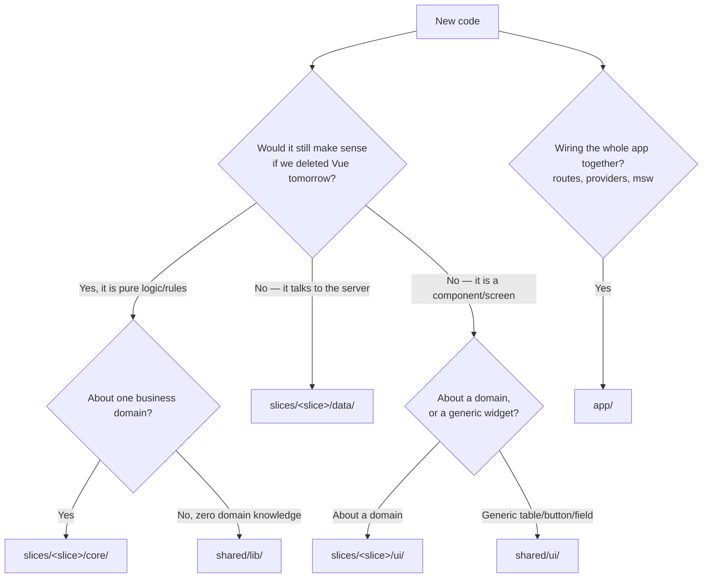
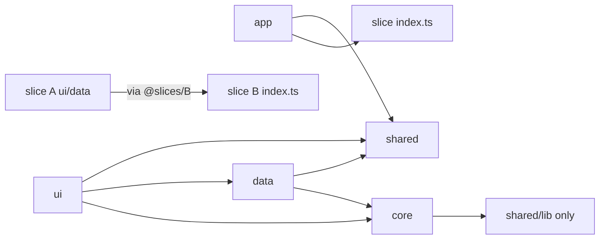

# Adding a feature — a field guide

New here? Read this once. It turns "where does this go?" into a lookup, not a debate.

[The constitution](constitution.md) has the rules (and why they exist); [Architecture](architecture.md)
has the model. This is the *field guide* — how you actually do the work. If anything here ever
disagrees with the constitution, the constitution wins — tell someone so we fix this file.

---

## 1. The one idea

Every file has a **coordinate** on two axes. Figure out the coordinate and you know
the folder — there is nothing left to argue about.

- **Which slice?** (the vertical axis) — the business capability: `billing` or
  `scheduling`. Slices are near-total silos.
- **Which layer?** (the horizontal axis) — *how often and why the code changes*:
  `core` → `data` → `ui`, plus two global bands (`shared`, `app`).



**The single rule everything rests on:** dependencies only ever point *toward
stability*. `ui` may use `core`; `core` may never reach `data` or `ui`; nothing
reaches sideways into another slice except through that slice's public `index.ts`.

---

## 2. Where is what

```
apps/web/src/
  app/                       # GLOBAL. The composition root. Imported by NOBODY.
    router/index.ts          #   concatenates each slice's routes.ts — nothing else
    providers/               #   msw bootstrap, error boundary, app-wide wiring (i18n, auth)
    layouts/DefaultLayout.vue
    views/ClientOverviewView.vue   # the ONE cross-slice screen
    main.ts                  #   boots the app
  slices/
    billing/                 # a domain slice (a silo)
      core/                  #   pure domain: entities, rules, invariants. NO framework.
        types.ts             #     Invoice, InvoiceLine, InvoiceStatus, …
        rules.ts             #     invoiceTotalMinor(), isOverdue(), … (pure functions)
        policy.ts            #     canVoid(), … (pure predicates)
      data/                  #   IO + mapping. Talks to the server; maps DTO <-> core.
        dto.ts               #     SERVER shapes (snake_case, zod schemas). Never leave here.
        mappers.ts           #     dto <-> core translation
        queries.ts           #     reads  (GET)
        mutations.ts         #     writes (POST/PATCH)
        store.ts             #     (optional) one Pinia cache — only if you need shared reactive state
        mocks.ts             #     MSW handlers = the fake backend for this slice
      ui/                    #   Vue. Assembles core + data into screens.
        views/               #     route targets (InvoiceListView.vue, InvoiceDetailView.vue)
        components/          #     pieces of a view (InvoiceLinesTable.vue, InvoiceStatusBadge.vue)
        composables/         #     the glue: useInvoiceList.ts, useInvoiceDetail.ts
      routes.ts              #   THIS slice's route definitions
      index.ts               #   THE ONLY public surface. Everything else is private.
    scheduling/              # the other slice — same shape (note: it has no store.ts, it doesn't need one)
  shared/                    # GLOBAL. Zero domain knowledge. Reusable by any slice.
    ui/                      #   shadcn-vue primitives: button, card, table, input, badge, …
    lib/                     #   format.ts, result.ts, useDebounce.ts, utils.ts (cn)
    http/                    #   transport.ts — knows how to fetch, knows no endpoints
```

**A slice is always exactly these five entries:** `core/`, `data/`, `ui/`,
`routes.ts`, `index.ts`. No `types/`, `utils/`, `helpers/`, or loose files at the
slice root — a test fails if you add one.

### The layers, in one table

| Layer      | Lives in            | Holds                                   | Changes when         | Global?        |
| ---------- | ------------------- | --------------------------------------- | -------------------- | -------------- |
| Primitives | `shared/ui`,`shared/lib`,`shared/http` | zero-domain widgets & helpers | the design system    | ✅ one copy    |
| Core       | `slices/*/core`     | pure entities, rules, policy            | business rules       | per slice      |
| Data / IO  | `slices/*/data`     | DTOs, mappers, queries, mutations, store, mocks | the API changes | per slice      |
| Feature UI | `slices/*/ui`       | views, components, composables          | the UX changes       | per slice      |
| App        | `src/app`           | router, providers, composition root     | features added/removed | ✅ one copy  |

---

## 3. How to add a feature (the workflow)

Work **inside-out**: `core` → `data` → `ui` → wire it up. Each layer only depends on
the ones more stable than it, so you never have to backtrack.

1. **Name the slice.** Ask *"what business reason would make this change?"* That
   answer is the slice. If you hear two unrelated reasons, it's two features — split
   them first.

2. **`core/` — the rule.** Add/extend the entity in `core/types.ts` and the pure
   logic in `core/rules.ts` or `core/policy.ts`. No `vue`, no `fetch`, no `new Date()`
   — if you need "now", take it as a parameter (`fn(invoice, now: Date)`). If you
   *can't* write it without the framework, it isn't core — it's `data` or `ui`.

3. **`data/` — the wire.** If the API changed, update `dto.ts` (the server shape) and
   `mappers.ts` (dto ↔ core). Add the read to `queries.ts` or the write to
   `mutations.ts`. Update `mocks.ts` so the fake backend returns the new shape. **The
   DTO never leaves `data/`** — always map it to a `core` type before returning.

4. **`ui/` — the screen.** Put the orchestration in a composable
   (`ui/composables/useThing.ts`): it calls `data/` and `core/`, and returns plain
   reactive state. The view/component renders that state. Reuse a component by adding
   a prop; only make a new component when it changes for a *new reason*.

5. **`routes.ts` / `index.ts` — expose it.** New screen → add it to the slice's
   `routes.ts`. Something in *another* slice or in `app/` needs it → export it from
   the slice's `index.ts` (the only public door). Keep that door tiny.

6. **Test & check.** Add a unit test for the `core` rule (they're pure, so this is
   easy and fast). Then run the checks in §5.

> **Rule of thumb:** if a step makes you reach *up* a layer (core wanting data) or
> *sideways* into another slice's folders, stop — you've mislabeled the coordinate.
> The tools will reject it anyway (§6).

---

## 4. Imports: what may talk to what

Use the aliases, not long relative paths:

| Alias            | Resolves to                        | Use it for                          |
| ---------------- | ---------------------------------- | ----------------------------------- |
| `@slices/<name>` | that slice's `index.ts` **only**   | reaching another slice's public API |
| `@shared/<path>` | `src/shared/<path>`                | primitives (`@shared/ui/button`)    |
| `@app/<path>`    | `src/app/<path>`                   | almost never — `app` is a leaf      |

Legal directions (everything else fails a check):



- **`core` is the strictest.** It may import only the npm allow-list (`zod`,
  `date-fns`, `decimal.js`) and `shared/lib` — and only the *pure* parts of it
  (`format`, `result`), never `useDebounce` (that one pulls in Vue).
- **Cross-slice is always via `@slices/<slice>`.** A deep import like
  `@slices/scheduling/core/rules` **does not resolve** — that's on purpose. Billing's
  composable importing `@slices/scheduling` is the canonical, blessed pattern (see
  [worked example 2](worked-examples.md)).
- **Your slice's `index.ts` re-exports only *your* slice.** Don't re-export another
  slice through it — that hides a sideways dependency (a check now catches this).

---

## 5. Running the checks locally

Run these before you push; CI runs the same ones.

```bash
vp lint                                       # fast syntactic boundary rules (Oxlint)
vp run --filter @vise/web typecheck           # vue-tsc --noEmit (types + deep-alias rejection)
vp run -r test                                # unit + structure + config-consistency tests
vp run --filter @vise/web arch:depcruise      # dependency graph: allow-list + baseline
vp run --filter @vise/web verify:enforcement  # proves every boundary rule still bites
```

`vp check` runs the common ones together. `architecture.config.ts` is the single
source of truth — if you change a boundary rule there, run
`vp run --filter @vise/web arch:generate` to regenerate the linter configs (a test
fails if you forget).

---

## 6. "CI is red" → what it means → the fix

Every rule is at `error` (there is no `warn`). Find your message here:

| You'll see (rule / message)                       | What you did                                             | The fix                                                                 |
| ------------------------------------------------- | ------------------------------------------------------- | ---------------------------------------------------------------------- |
| `slice-isolation` / `not-in-allowed`              | imported another slice's internals                      | import `@slices/<slice>` (its `index.ts`), or export what you need from there |
| `layers-point-down`                               | `core/` imported `data/` or `ui/`                       | move the impure bit out of core; let the outer layer call the pure rule |
| `data-not-to-ui`                                  | `data/` imported `ui/`                                   | data never touches the UI — invert it                                   |
| `core-is-framework-free`                          | `core/` imported a non-allow-listed npm package         | it's a framework/IO concern → `data/` or `ui/`; or add it to the allow-list via review |
| `core-stays-framework-free`                       | `core/` reached Vue *transitively* (e.g. via `useDebounce`) | in core, import only pure `shared/lib` (`format`, `result`)         |
| `dtos-stay-home`                                  | a `data/dto` type leaked into `ui/`/`core/`             | map the DTO to a `core` type inside `data/` and return that            |
| `public-index-no-relaunder`                       | your slice's `index.ts` re-exported another slice       | import the other slice at the use-site, not through your public door    |
| `shared-knows-nothing`                            | `shared/` imported a slice or `app`                     | shared is domain-free — move the domain bit into the slice              |
| `app-is-a-leaf`                                   | something imported from `app/`                          | app is the root; move the shared thing down into a slice or `shared/`   |
| `no-restricted-imports` (Oxlint)                  | relative path climbing out of a slice, or `vue` in core | use the `@slices`/`@shared` alias; keep framework out of core           |
| typecheck: `Cannot find module '@slices/x/core/…'`| deep alias import                                       | import the slice's public `index.ts`, never a deep path                 |
| structure test: *"exactly … core, data, ui, routes.ts, index.ts"* | added a stray file/dir at a slice root | move it into `core`/`data`/`ui`                            |
| structure test: *"core/ is pure"*                 | `new Date()`/`Date.now()`/`Math.random()` in `core/`    | pass `now`/`today` in as an argument                                    |
| structure test: *"non-literal specifier"*         | `import(\`@slices/${x}\`)` (computed dynamic import)    | use a literal specifier: `import("./ui/views/Foo.vue")`                 |
| structure test: *"defineStore … outside … data/"* | a Pinia store outside `slices/*/data/`                   | move it into the slice's `data/`                                        |
| structure test: *"snake_case type member … outside data/dto.ts"* | declared a server shape somewhere other than `dto.ts` | put the server type in `data/dto.ts` and map it |
| structure test: *"domain noun … under shared/"*   | a domain word in a `shared/` filename/export            | it's not generic → move it into the slice                              |
| `arch:baseline:check` / `arch:module-count`       | baseline grew, or the graph didn't parse                | you can only *shrink* the baseline; ask a maintainer if the count looks wrong |

**Never** silence a boundary rule with an inline `// oxlint-disable …` or
`// dependency-cruiser-ignore` — a separate check fails on those. The only escape
hatch is a reviewed change to `architecture.config.ts` (CODEOWNERS-protected).

---

## 7. The tricky ones: cross-slice & cross-cutting

- **A feature that reads another slice's data** (e.g. show an invoice's appointment):
  it belongs to the slice it is *about*; consume the other slice through
  `@slices/<slice>`. See [worked example 2](worked-examples.md) and rule 5's *about-vs-reads*
  corollary.

- **A capability about one slice that also reads another** (e.g. "billing periods"
  that total invoices over a date range using scheduling data): fold it into the slice
  it's about (`billing`), reading `@slices/scheduling`. Don't spin up a new slice
  unless it has its *own* reason to change. ([worked example 6](worked-examples.md).)

- **A concern orthogonal to every slice** (audit log, authorization, feature flags,
  telemetry, i18n): that's **rule 8**. It's not a layer and not `shared/` (it knows
  domain shapes) — give it its **own slice**, invoke it through its `index.ts`, wire
  it in each observed slice's **`data/`** layer (not `ui/`), and pass any
  identity/config **down from `app/` as a primitive** (a string), never as another
  slice's type. [Worked examples](worked-examples.md) 4 (audit) and 5 (finance-only void) walk
  these end to end.

- **A feature flag** is runtime config, not a domain rule: fetch it in `data/`, gate
  the UI in `ui/`, and keep `core/` rules pure.

---

## 8. Quick "where do I put…?" reference

| I want to add…                                  | It goes in…                                        |
| ----------------------------------------------- | -------------------------------------------------- |
| a new field on an entity                        | `slices/<slice>/core/types.ts` (+ `data/dto.ts` + `mappers.ts` if the API has it) |
| a calculation / business rule                   | `slices/<slice>/core/rules.ts`                     |
| a permission / "can the user do X?"             | `slices/<slice>/core/policy.ts` (keyed on a primitive like `role: string`) |
| a new API call                                  | `slices/<slice>/data/queries.ts` (read) or `mutations.ts` (write) |
| cached reactive state across views              | `slices/<slice>/data/store.ts` (Pinia — only if you truly need it) |
| a new screen                                     | `slices/<slice>/ui/views/` + `routes.ts`           |
| a piece of a screen                             | `slices/<slice>/ui/components/`                     |
| the glue between a screen and core/data         | `slices/<slice>/ui/composables/`                   |
| a generic button/table/input (no domain nouns)  | `shared/ui/`                                        |
| a generic helper (formatDate, debounce, cn)     | `shared/lib/`                                       |
| a cross-cutting concern (audit, authz, flags)   | its **own slice** (rule 8)                          |
| the one screen that spans slices                | `app/views/` (this is the *only* place that's allowed) |
| app-wide setup (router, msw, i18n locale)       | `app/` (`router/`, `providers/`)                   |

When in doubt, walk the [helper questions](constitution.md#helper-questions) —
they were written to give exactly one answer.
