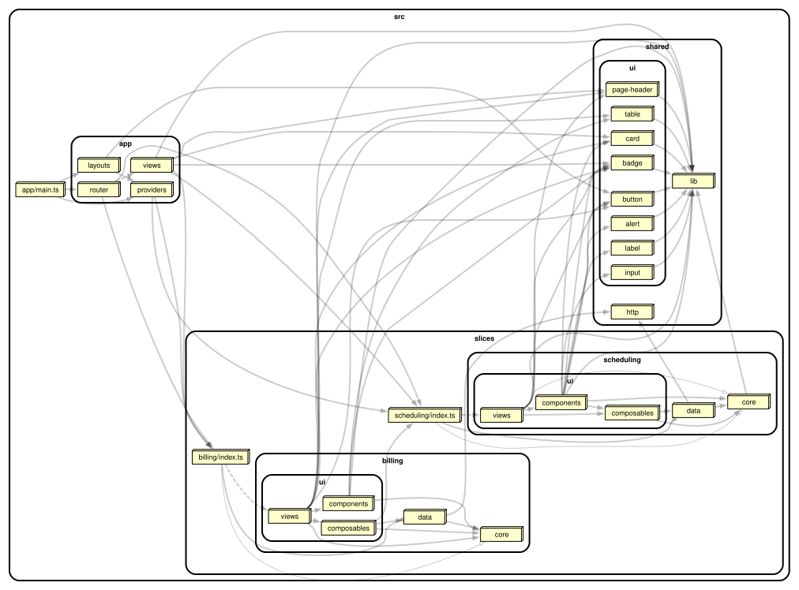
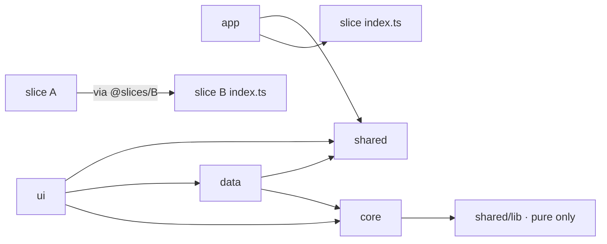

[← README](../README.md) · **Architecture** · [Constitution](constitution.md) · [Adding a feature](adding-a-feature.md) · [Worked examples](worked-examples.md) · [Enforcement](enforcement.md) · [Reading the graph](reading-the-graph.md)

# Architecture — the two axes

Every file has a coordinate on two axes. Because both are derivable from the
code's purpose, its location is derivable — there is never a discussion about
where something goes.

## Axis 1 — domain slice (vertical)

The business capability the code belongs to. Slices are near-total silos:
`billing`, `scheduling`.

## Axis 2 — stability layer (horizontal)

How often the code changes, and why.

| Layer         | Contains                                                     | Changes when               | Scope                      |
| ------------- | ------------------------------------------------------------ | -------------------------- | -------------------------- |
| Primitives    | Zero domain knowledge: `Button`, `useDebounce`, `formatDate` | design system evolves      | **Global** (`src/shared/`) |
| Domain core   | Pure logic, entities, rules, invariants. No framework.       | business rules change      | **Per slice** (`core/`)    |
| Data / IO     | Queries, mutations, DTOs, DTO↔core mapping                   | the API changes            | **Per slice** (`data/`)    |
| Feature UI    | Components and views assembling core + data                  | the UX changes             | **Per slice** (`ui/`)      |
| App / routing | Route table, providers, composition root                     | features are added/removed | **Global** (`src/app/`)    |

Two layers are **global singletons** (primitives, app/routing); three are
**replicated once per slice** (core, data, ui). The shape is two horizontal
bands sandwiching vertical domain silos:



Regenerate the graph after a structural change with `node scripts/render-graph.ts`. See [Reading the graph](reading-the-graph.md) for how to read one and what to watch for.

## The one rule everything rests on

**Dependencies only ever point toward stability.** Feature UI may import domain
core. Domain core may never import data/IO or feature UI. Nothing points sideways
between slices except through a slice's public `index.ts`.



## Folder layout

```
architecture.config.ts        # SINGLE SOURCE OF TRUTH for the boundary rules
vite.config.ts                # root: staged hooks + generated Oxlint overrides
scripts/                      # config generation + enforcement verification
apps/web/
  src/
    app/                      # GLOBAL: composition root (imported by nobody)
      router/index.ts         #   concatenates slice route definitions ONLY
      providers/              #   msw bootstrap, error boundary, app-wide wiring (i18n)
      layouts/DefaultLayout.vue
      views/ClientOverviewView.vue   # the ONLY cross-slice composition view
      main.ts
    slices/
      billing/  scheduling/
        core/                 # PER SLICE: pure entities, rules, policy (no framework)
        data/                 # PER SLICE: dto, mappers, queries, mutations, (one) store, mocks
        ui/                   # PER SLICE: views/, components/, composables/
        routes.ts             # this slice's route definitions
        index.ts              # THE ONLY public surface
    shared/
      ui/                     # GLOBAL: shadcn-vue primitives, zero domain nouns
      lib/                    # GLOBAL: cn, formatDate, Result, useDebounce
      http/                   # GLOBAL: transport only, no endpoints
```

A slice is always **exactly** `core/`, `data/`, `ui/`, `routes.ts`, `index.ts` —
nothing else. No `utils/`, `helpers/`, or `types/` at the slice root (a structure
test fails if you add one).

## Path aliases

Reach across boundaries with aliases, never long relative paths:

| Alias            | Resolves to                      | Use it for                          |
| ---------------- | -------------------------------- | ----------------------------------- |
| `@slices/<name>` | that slice's `index.ts` **only** | reaching another slice's public API |
| `@shared/<path>` | `src/shared/<path>`              | primitives (`@shared/ui/button`)    |
| `@app/<path>`    | `src/app/<path>`                 | almost never — `app` is a leaf      |

A deep import like `@slices/scheduling/core/rules` **does not resolve** — that's
the point. See [Adding a feature](adding-a-feature.md) for the day-to-day workflow.
